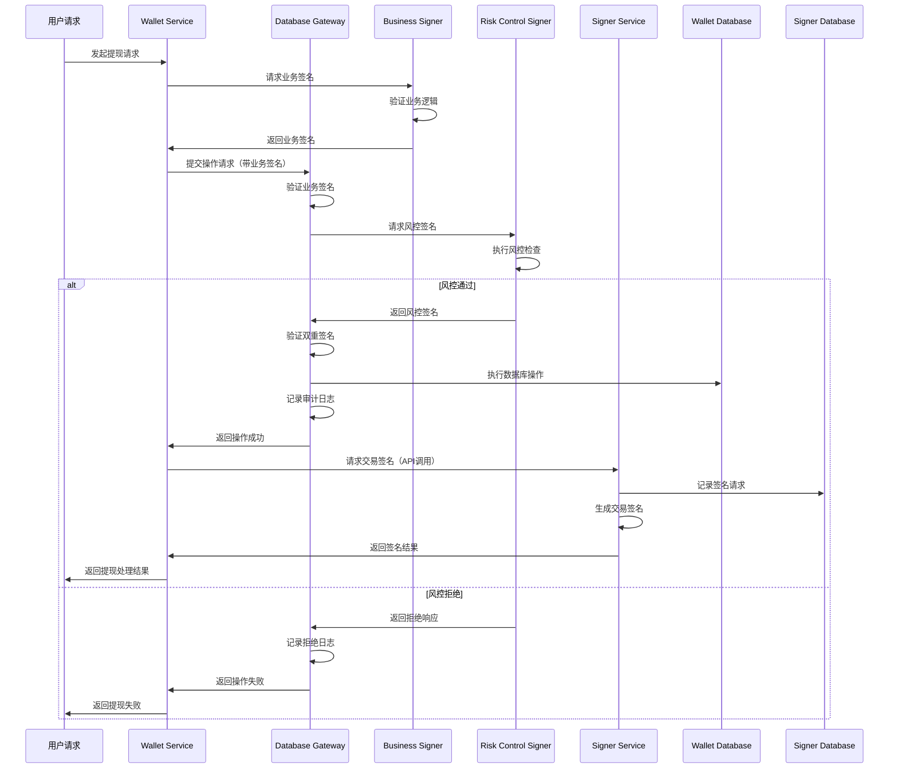

# 数据库网关服务与双签名机制设计文档

## 1. 项目背景

### 1.1 现状分析

当前系统各模块使用独立数据库：
- **Signer**: 独立数据库 `signer.db`，存储地址生成记录和密钥管理信息
- **Wallet**: 主数据库 `wallet.db`，存储用户、余额、交易、提现等核心数据
- **Scan**: 共享 `wallet.db`，进行区块链扫描和充值检测

**存在的安全风险**：
- wallet和scan直接访问数据库，缺乏统一权限控制
- 开发人员可以绕过业务逻辑直接修改敏感数据
- 无法有效防范内部作恶行为
- 敏感操作（如提现）缺乏有效的多重验证
- signer模块虽然独立，但与其他模块缺乏安全的协作机制

### 1.2 设计目标

- **数据库隔离**: signer保持独立数据库，wallet和scan通过网关访问
- **权限隔离**: 业务模块无法直接访问核心数据库
- **操作审计**: 所有数据库操作都有完整的审计日志
- **防内幕作恶**: 敏感操作需要多重签名验证
- **安全协作**: signer与其他模块通过安全API协作

## 2. 架构设计

### 2.1 整体架构

```
┌─────────────────┐    ┌─────────────────┐    ┌─────────────────┐
│   Wallet API    │    │   Scanner API   │    │   Signer API    │
└─────────────────┘    └─────────────────┘    └─────────────────┘
         │                       │                       │
         │(API Calls)             │(API Calls)            │(独立运行)
         │                       │                       │
         └───────────────────────┼───────────────────────┘
                                 │                       │
                    ┌─────────────────┐                  │
                    │ Database Gateway│                  │
                    │    Service      │                  │
                    └─────────────────┘                  │
                                 │                       │
         ┌───────────────────────┼───────────────────────┘
         │                       │
┌─────────────────┐    ┌─────────────────┐    ┌─────────────────┐
│ Business Signer │    │    Audit Log    │    │Risk Control     │
│    Service      │    │    Service      │    │   Signer        │
└─────────────────┘    └─────────────────┘    └─────────────────┘
                                 │
                    ┌─────────────────┐    ┌─────────────────┐
                    │   Wallet DB     │    │   Signer DB     │
                    │   (SQLite)      │    │   (SQLite)      │
                    │   统一管理        │    │   独立管理       │
                    └─────────────────┘    └─────────────────┘
```

### 2.2 数据库分离策略


#### 2.2.2 Wallet数据库 (wallet.db) - 网关管理
**存储内容**:
- 用户账户信息
- 钱包地址管理
- 资金流水和余额
- 交易记录和提现申请
- 区块链扫描数据

**访问控制**:
- wallet和scan模块通过数据库网关访问
- 所有操作需要签名验证
- 敏感操作需要双重签名

### 2.3 模块间协作机制

#### 2.3.1 Signer模块独立性
**服务提供**:
- 地址生成API：为wallet提供新地址
- 签名服务API：为提现等操作提供签名
- 密钥管理：独立管理所有私钥，绝不外泄

**安全保证**:
- 物理隔离：独立的数据库和服务
- API认证：通过JWT token验证调用者身份
- 操作审计：记录所有签名请求和结果

#### 2.3.2 Wallet/Scan网关化改造
**改造范围**:
- 移除直接数据库访问代码
- 通过Database Gateway API进行数据操作
- 签名验证机制集成

**改造策略**:
- 渐进式迁移，优先改造敏感操作
- 保持API兼容性
- 增加操作审计和监控

### 2.4 数据库网关服务架构

#### 2.4.1 核心组件

**DatabaseGateway Service**
- 统一的数据库访问入口
- 权限验证和操作授权
- 请求签名验证
- 操作审计日志记录

**Permission Manager**
- 基于角色的权限控制（RBAC）
- 操作级别的权限管理
- 动态权限策略配置

**Signature Validator**
- 单签名和双签名验证
- 签名时效性检查
- 防重放攻击机制

**Audit Logger**
- 所有操作的详细日志记录
- 支持实时监控和告警
- 日志完整性保护

#### 2.4.2 权限分级设计

**Level 1 - 读操作**
- 权限要求：模块身份验证
- 适用操作：查询用户余额、钱包信息、交易记录等
- 签名要求：模块身份Token
- 适用模块：Wallet、Scan

**Level 2 - 一般写操作**
- 权限要求：业务模块签名
- 适用操作：区块链扫描数据录入、钱包状态更新等
- 签名要求：业务模块签名
- 适用模块：Scan（充值检测）、Wallet（非敏感更新）

**Level 3 - 敏感操作**
- 权限要求：业务 + 风控双重签名
- 适用操作：用户余额变更、提现处理、热钱包操作
- 签名要求：业务签名 + 风控签名
- 适用模块：Wallet（提现、余额调整）

**Level 4 - 跨模块协作**
- Signer模块独立运行，通过API提供服务
- Wallet调用Signer API获取地址和签名服务
- 所有跨模块调用都需要JWT认证

## 3. 双签名机制设计

### 3.1 签名体系

#### 3.1.1 签名者角色

**Business Signer（业务签名者）**
- 负责：业务逻辑验证和操作发起
- 权限：可以发起所有业务操作
- 密钥管理：由业务模块管理，支持密钥轮换

**Risk Control Signer（风控签名者）**
- 负责：风险评估和审批决策
- 权限：可以审批或拒绝敏感操作
- 密钥管理：独立管理，物理隔离

#### 3.1.2 签名格式

**JWT Token 结构**
```json
{
  "header": {
    "alg": "RS256",
    "typ": "JWT",
    "kid": "signer_key_id"
  },
  "payload": {
    "iss": "business_signer|risk_control_signer",
    "sub": "operation_id",
    "aud": "database_gateway",
    "exp": 1640995200,
    "iat": 1640908800,
    "jti": "unique_token_id",
    "operation": {
      "type": "withdraw",
      "table": "credits",
      "action": "insert",
      "data_hash": "sha256_hash_of_operation_data",
      "params": {
        "user_id": 123,
        "amount": "1000000000000000000",
        "token_id": 1
      }
    }
  },
  "signature": "..."
}
```

### 3.2 双签名流程

#### 3.2.1 提现操作流程



#### 3.2.2 自动化风控决策

**低风险操作自动通过**
- 小额提现（< 1000 USDT）
- 白名单地址提现
- 24小时内首次提现

**中风险操作延迟处理**
- 中额提现（1000-10000 USDT）
- 新地址提现
- 频繁提现

**高风险操作人工审核**
- 大额提现（> 10000 USDT）
- 黑名单地址
- 异常行为模式

## 4. 技术实现

### 4.1 数据库网关API设计

#### 4.1.1 统一请求格式

```typescript
interface GatewayRequest {
  operation_id: string;           // 操作唯一ID
  operation_type: 'read' | 'write' | 'sensitive';
  table: string;                  // 目标表名
  action: 'select' | 'insert' | 'update' | 'delete';
  data?: any;                     // 操作数据
  conditions?: any;               // 查询条件
  business_signature: string;     // 业务签名
  risk_control_signature?: string; // 风控签名（敏感操作必需）
  timestamp: number;              // 请求时间戳
}
```

#### 4.1.2 响应格式

```typescript
interface GatewayResponse {
  success: boolean;
  operation_id: string;
  data?: any;
  error?: {
    code: string;
    message: string;
    details?: any;
  };
  audit_log_id: string;           // 审计日志ID
}
```

### 4.2 关键操作实现

#### 4.2.1 提现操作保护

```typescript
class WithdrawOperationHandler {
  async processWithdraw(request: WithdrawRequest): Promise<WithdrawResponse> {
    // 1. 验证业务签名
    const businessSignValid = await this.verifyBusinessSignature(request);
    if (!businessSignValid) {
      throw new Error('业务签名验证失败');
    }

    // 2. 风控评估
    const riskScore = await this.calculateRiskScore(request);

    // 3. 根据风险等级决定处理方式
    if (riskScore < RISK_THRESHOLD_LOW) {
      // 低风险：自动风控签名
      const autoRiskSignature = await this.generateAutoRiskSignature(request);
      return await this.executeWithdraw(request, autoRiskSignature);
    } else {
      // 高风险：需要人工风控签名
      return await this.requestManualRiskApproval(request);
    }
  }
}
```

#### 4.2.2 审计日志记录

```typescript
interface AuditLog {
  id: string;
  operation_id: string;
  operation_type: string;
  table_name: string;
  action: string;
  data_before?: any;              // 操作前数据
  data_after?: any;               // 操作后数据
  business_signer: string;        // 业务签名者
  risk_control_signer?: string;   // 风控签名者
  ip_address: string;             // 请求IP
  user_agent: string;             // 用户代理
  timestamp: number;              // 操作时间
  result: 'success' | 'failed';   // 操作结果
  error_message?: string;         // 错误信息
}
```

### 4.3 安全措施

#### 4.3.1 防重放攻击

- 操作ID唯一性检查
- 时间戳有效期验证（5分钟窗口）
- Nonce机制防止重复提交

#### 4.3.2 密钥管理

- 定期密钥轮换（每30天）
- 密钥安全存储（HSM或安全环境变量）
- 密钥权限最小化原则

#### 4.3.3 监控告警

- 异常操作模式检测
- 签名验证失败告警
- 大额操作实时通知
- 系统性能监控

## 5. 部署架构

### 5.1 服务部署

**Database Gateway Service**
- 独立部署，单独的服务端口
- 只允许内网访问
- 支持水平扩展和负载均衡

**Business Signer Service**
- 与业务模块部署在同一环境
- 密钥通过环境变量管理
- 支持密钥热更新

**Risk Control Signer Service**
- 独立部署，物理隔离
- 专用的风控决策环境
- 支持人工审核界面

### 5.2 网络安全

- 内网通信加密（TLS 1.3）
- 服务间API密钥认证
- 防火墙规则严格控制
- VPN访问控制

### 5.3 数据备份

- 数据库定时备份
- 审计日志归档存储
- 签名密钥安全备份
- 灾难恢复方案

## 6. 实施计划

### 6.1 Phase 1: 基础架构

**周期**: 2-3周

**任务**:
- 实现Database Gateway Service基本框架
- 实现模块身份认证机制
- 完成读操作的权限控制
- 基础审计日志功能
- Signer API安全认证机制

**交付物**:
- Database Gateway Service v1.0
- 基础权限管理系统
- 审计日志框架
- Signer API认证系统

### 6.2 Phase 2: 双签名机制与模块改造

**周期**: 3-4周

**任务**:
- 实现Business Signer Service
- 实现Risk Control Signer Service
- 完成提现操作的双签名保护
- 风控决策引擎集成
- Wallet模块改造（移除直接数据库访问）
- Scan模块改造（移除直接数据库访问）

**交付物**:
- 完整的双签名机制
- 提现操作保护
- 风控决策系统
- 改造后的Wallet和Scan模块

 

## 7. 风险评估

### 7.1 技术风险

**可用性风险**
- 缓解措施：服务冗余部署，熔断机制
- 监控指标：服务可用性 > 99.9%

**性能风险**
- 缓解措施：缓存机制，数据库优化
- 监控指标：响应时间 < 100ms

**安全风险**
- 缓解措施：定期安全审计，密钥管理
- 监控指标：零安全事故

### 7.2 运维风险

**密钥泄露**
- 预防措施：密钥定期轮换，访问权限控制
- 应急响应：密钥撤销和重新生成流程

**服务故障**
- 预防措施：健康检查，自动故障转移
- 应急响应：快速恢复和回滚机制

## 8. 总结

本设计方案通过引入独立的数据库网关服务和双签名机制，并保持signer模块的独立性，显著提升了系统的安全性：

**安全提升**:
- 消除了wallet和scan直接数据库访问的安全风险
- 保持signer模块的物理隔离和独立数据库
- 通过双签名机制防止内部作恶
- 完整的操作审计和监控体系

**架构优势**:
- 模块职责清晰分离，降低系统复杂度
- 统一的权限管理和访问控制（wallet/scan）
- signer模块独立性保证密钥安全
- 支持灵活的风控策略配置

**数据库策略**:
- Signer数据库完全独立，密钥信息隔离
- Wallet数据库通过网关统一管理
- 多数据库架构保证安全性和可维护性

**实施可行性**:
- 渐进式部署，优先改造敏感操作
- 与现有系统兼容，平滑迁移
- 保持signer模块现有功能不变
- 完善的监控和运维支持

该方案为交易所钱包系统提供了企业级的安全保障，在保证安全性的同时维持了系统架构的合理性，满足了金融级别的安全要求。